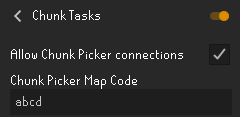
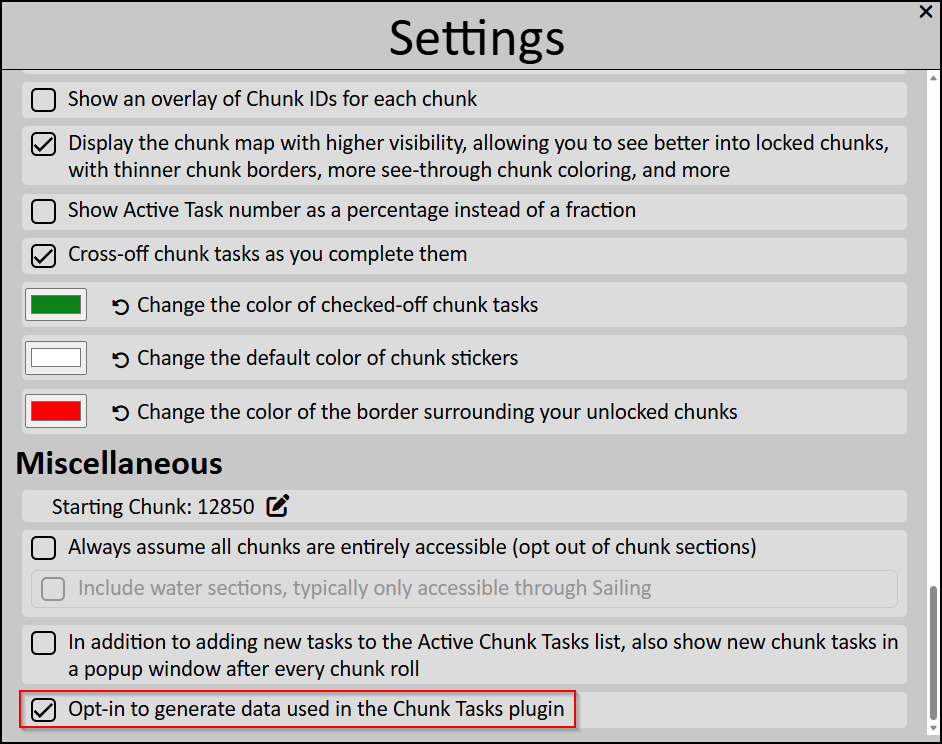
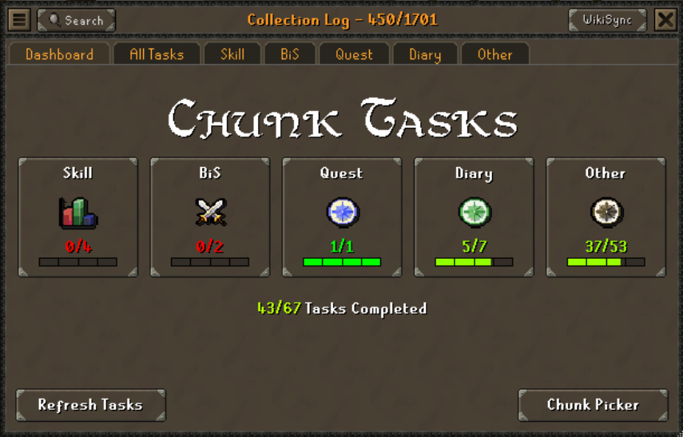
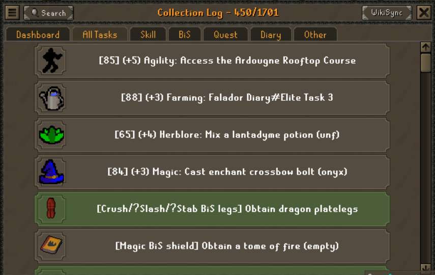
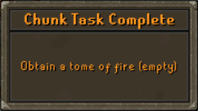
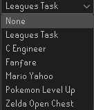

# Chunk Tasks
A plugin to view and track chunk tasks and notify when then are completed

## Setup
1. Allow Chunk Picker connections
2. Enter Chunk Picker map code (generated from https://source-chunk.github.io/chunk-picker-v2/)\

3. From the Chunk Picker website, Opt-in to Chunk Tasks plugin\

## Features

### Chunk Tasks Dashboard
View Chunk tasks and mark them as completed. This does not mark task as completed on the Chunk Picker website.

### Chunk Task Complete Notifications
Receive automated in-game pop-up notifications when tasks are completed.\
Not all tasks can be automatically recognized as complete, but I'm trying to wire up as many as possible!

Customize notification sounds to the jingle that gives you the

